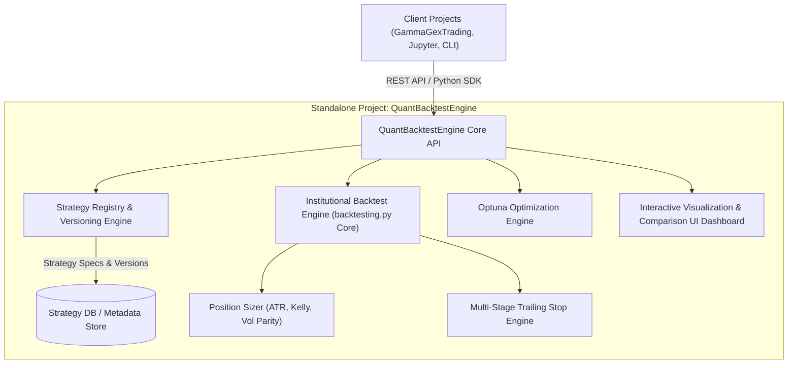

# Standalone Quant Backtesting, Optimization & Strategy Management Platform (`QuantBacktestEngine`)

## Executive Summary & System Scope
This proposal outlines the design and architecture for a **standalone, reusable, scalable, fast, and customizable Backtesting, Optimization & Strategy Management Engine** (`QuantBacktestEngine`). 

Architected as an independent, modular system:
1. **Standalone & Universal**: Can be imported as a Python package (`pip install -e .`), invoked via REST API / CLI, or integrated into any current (e.g., `GammaGexTrading`) or future quantitative trading project.
2. **Strategy Versioning & Lifecycle Management**: Provides a declarative strategy specification format (YAML/JSON + Python DSL) with built-in version tracking, strategy diffing, and historical run archiving.
3. **Institutional Risk & Trailing Stop Engine**: Features ATR Risk Sizing, Fractional Kelly, Volatility Parity, Equity Drawdown Guards, and state-of-the-art multi-stage trailing stops (Break-Even Ratchets, Chandelier Exits, Profit Locks).
4. **Optimization Engine**: Multiprocessing grid search and Optuna Bayesian Optimization with high-dimensional hyperparameter surface mapping.
5. **Rich Interactive Visualization & Comparison UI**: A modern web dashboard for single-click backtesting, strategy version side-by-side overlay, hyperparameter surface plots, MAE/MFE trade distribution charts, and monthly returns heatmaps.

---

## Technical Architecture & Core Subsystems



---

## 1. Standalone Package Architecture
The project will be built as a self-contained repository (`QuantBacktestEngine`) with zero hard dependencies on external projects:

```
QuantBacktestEngine/
├── pyproject.toml / setup.py       # Package distribution definition
├── README.md                       # Complete documentation & quickstart
├── implementation_plan.md          # Technical design & research specification
├── quant_engine/                   # Core Python Package
│   ├── __init__.py
│   ├── api.py                      # Main Python API entrypoint (Engine, Strategy, Optimizer)
│   ├── core/                       # Execution & simulation core
│   │   ├── runner.py               # Vectorized event runner wrapping backtesting.py
│   │   ├── data.py                 # Universal data loader (yfinance, CSV, Parquet, Alpaca)
│   │   └── metrics.py              # Performance calculations (Sharpe, Sortino, Calmar, SQN)
│   ├── risk/                       # Risk management modules
│   │   ├── sizer.py                # Position sizer (ATR, Fractional Kelly, Risk Parity)
│   │   └── trailing_stop.py        # Multi-stage trailing stop engine
│   ├── strategy/                   # Strategy management & versioning
│   │   ├── base.py                 # Base Strategy class
│   │   ├── declarative.py          # YAML/JSON strategy spec parser
│   │   ├── repository.py           # Strategy DB & version control manager
│   │   └── comparator.py           # Multi-strategy performance comparator
│   ├── optimization/               # Parameter tuning
│   │   ├── grid.py                 # Multi-core parallel grid search
│   │   └── optuna_tpe.py           # Optuna Bayesian optimization & pruning
│   └── server/                     # Standalone REST API & UI Server
│       ├── app.py                  # FastAPI web server
│       └── static/                 # Rich Visualization Dashboard (HTML5 / JS / Canvas)
├── tests/                          # Unit & integration test suite
└── examples/                       # Example strategies & usage scripts
```

---

## 2. Strategy Versioning & Lifecycle Management
To enable seamless strategy creation, iteration, and side-by-side version comparison:

### A. Declarative & Code-Based Strategy Definition
Strategies can be defined in **Python code** or as **Declarative Specs (YAML/JSON)**:

```yaml
# Example Strategy Spec (gex_momentum_v1.2.yaml)
name: "GEX_Momentum_Breakout"
version: "1.2.0"
author: "Quant Team"
description: "Options GEX regime breakout with ATR dynamic position sizing"
data:
  symbol: "SPY"
  timeframe: "1d"
indicators:
  ema_fast: { type: "EMA", period: 20 }
  atr: { type: "ATR", period: 14 }
position_sizing:
  type: "atr_risk"
  risk_pct: 0.015               # Risk 1.5% account equity per trade
  drawdown_scaling: true        # Throttle risk by 50% if drawdown > 10%
trailing_stop:
  type: "chandelier_ratchet"
  atr_multiplier: 3.0
  breakeven_trigger_r: 1.0       # Move stop to BE at +1.0R
  profit_lock_tiers:
    - { r_multiple: 2.0, atr_multiplier: 2.0 }
    - { r_multiple: 3.0, atr_multiplier: 1.5 }
```

### B. Strategy Repository & Version DB (`quant_engine/strategy/repository.py`)
- Maintains a SQLite metadata database (`strategies.db`) tracking:
  - **Strategy Registry**: Id, Name, Version, Spec Hash, Creation Date.
  - **Version Lineage**: Parent strategy version, parameters diff, changelog.
  - **Run Archive**: Historical backtest results (equity curves, trade logs, parameters) keyed by strategy version.

### C. Version Comparison Engine (`quant_engine/strategy/comparator.py`)
- Provides a matrix comparison tool evaluating multiple strategy versions side-by-side:
  - Performance Metrics Table (CAGR, Sharpe, Sortino, Max DD, Win Rate, Profit Factor, Exposure Time).
  - Trade Correlation Matrix (identifying if Version B improves entry efficiency or just doubles down on Version A's trades).

---

## 3. Rich Visualization & Dashboard UI (`quant_engine/server/`)
A built-in web dashboard (accessible via `quant-engine ui` or `python -m quant_engine.server` at `http://localhost:8500`) providing institutional-grade visual analytics:

### A. Key UI Features & Views

1. **Interactive Equity & Drawdown Charting**:
   - High-performance canvas chart (using TradingView Lightweight Charts / Plotly).
   - Dual-axis display: Equity curve vs Benchmark (SPY) + Underwater Drawdown waterfall chart.
   - Monthly & Annual Returns Heatmap table.

2. **Strategy Version Comparison View**:
   - Multi-line chart overlaying equity curves of Strategy V1.0 vs V1.1 vs V1.2 vs SPY.
   - Side-by-side metric comparison card highlighting changes in Sharpe, Win Rate, and Drawdown.

3. **Hyperparameter Optimization & Surface Explorer**:
   - Optuna 3D/2D Parameter Surface Heatmaps (e.g. EMA period vs ATR Multiplier vs Sharpe Ratio).
   - Optimization Trial Parallel Coordinate plots & Parameter Importance bar charts.

4. **Trade Execution & MAE/MFE Analytics**:
   - Interactive Trade Log table with filtering and export capabilities.
   - **MAE/MFE (Maximum Adverse / Favorable Excursion)** scatter plots to analyze stop-loss efficiency.
   - Win/Loss Trade Duration Histograms.

5. **Visual Strategy Builder & Spec Editor**:
   - In-browser code/YAML editor to edit strategy parameters, save new versions, and trigger instant backtests.

---

## Verification Plan

### Automated Tests
1. **Engine Core Tests**: Verify backtest accuracy against known benchmarks (`tests/test_runner.py`).
2. **Risk & Sizing Tests**: Test ATR risk sizing, Kelly allocation, drawdown throttling, and trailing stop state machine (`tests/test_risk.py`).
3. **Repository & Versioning Tests**: Verify strategy spec saving, version incrementing, and comparison matrix generation (`tests/test_repository.py`).
4. **Optimization Tests**: Run multi-trial Optuna parameter tuning and check convergence (`tests/test_optimization.py`).

### Manual / UI Verification
1. Launch standalone dashboard UI via `python -m quant_engine.server` and test:
   - Creating, editing, and saving a new strategy version.
   - Running single backtests and viewing interactive equity/drawdown charts.
   - Running multi-version strategy comparison and inspecting overlay charts.
   - Exploring Optuna 3D parameter optimization surfaces.
